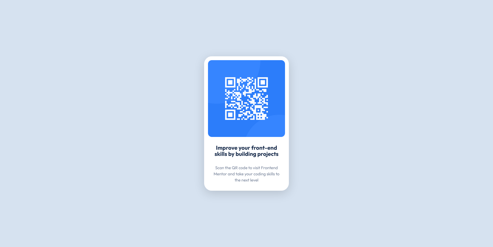

# Frontend Mentor - QR code component solution

This is a solution to the [QR code component challenge on Frontend Mentor](https://www.frontendmentor.io/challenges/qr-code-component-iux_sIO_H). Frontend Mentor challenges help you improve your coding skills by building realistic projects.

## Table of contents

- [Overview](#overview)
  - [Screenshot](#screenshot)
  - [Links](#links)
- [My process](#my-process)
  - [Built with](#built-with)
  - [What I learned](#what-i-learned)
- [Author](#author)

## Overview

### Screenshot

### Links

- Solution URL: [Add solution URL here](https://www.frontendmentor.io/solutions/qr-code-component-YgDr42-e0I)
- Live Site URL: [Add live site URL here](https://qr-code-component-bvx.pages.dev/)

## My process

### Built with

- CSS custom properties
- Flexbox
- Mobile-first workflow
- [React](https://reactjs.org/) - JS library

### What I learned

Reinforcing basics

## Author

- Website - [Haakon Mydland](https://www.haakonmydland.com/home)
- Frontend Mentor - [@haakonmydland](https://www.frontendmentor.io/profile/haakonmydland)
- Twitter - [@haakonmydland](https://www.twitter.com/haakonmydland)
